# Customer Churn Prediction & Customer Retention Analysis

Bài toán dự đoán khách hàng có khả năng rời khỏi dịch vụ & phân tích giữ chân khách hàng

**Thời gian:** Tháng 8/2026

---

##  Giới thiệu

Customer Churn (khách hàng rời bỏ) là hiện tượng khách hàng ngừng sử dụng sản phẩm/dịch vụ của doanh nghiệp. Việc dự đoán sớm nhóm khách hàng có nguy cơ rời bỏ giúp doanh nghiệp chủ động xây dựng chiến lược giữ chân, tiết kiệm chi phí thu hút khách hàng mới.

Đề tài xây dựng một quy trình hoàn chỉnh: **thu thập dữ liệu → tiền xử lý → EDA → feature engineering → xây dựng mô hình → đánh giá → giải thích mô hình (XAI) → phân tích Customer Retention**.

##  Mục tiêu

- Tiền xử lý và phân tích khám phá (EDA) bộ dữ liệu khách hàng.
- Xác định các đặc trưng ảnh hưởng đến khả năng churn.
- Xây dựng và so sánh 3 mô hình phân loại: **Logistic Regression, Random Forest, XGBoost**.
- Đánh giá mô hình qua Accuracy, Precision, Recall, F1-score, ROC-AUC.
- Giải thích mô hình bằng **SHAP** (Explainable AI).
- Phân nhóm khách hàng theo mức độ rủi ro và đề xuất chiến lược retention.

##  Dữ liệu sử dụng

- **Nguồn:** `Churn_Modelling.csv` (Kaggle)
- **Quy mô:** 10.000 bản ghi × 14 thuộc tính, không có missing values / duplicates.
- **Biến mục tiêu:** `Exited` (1 = churn, 0 = không churn) — mất cân bằng lớp ~20.4% churn / 79.6% không churn.

| Nhóm biến | Các cột |
|---|---|
| Định danh (loại bỏ) | RowNumber, CustomerId, Surname |
| Nhân khẩu học | Geography, Gender, Age |
| Tài chính | CreditScore, Balance, EstimatedSalary |
| Hành vi/hợp đồng | Tenure, NumOfProducts, HasCrCard, IsActiveMember |
| Mục tiêu | Exited |

**Train/Test split:** 80% (8.000) / 20% (2.000), stratify theo `y`.

### Phân phối các biến trong tập dữ liệu

| | | |
|---|---|---|
| 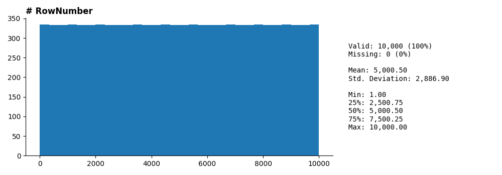 | 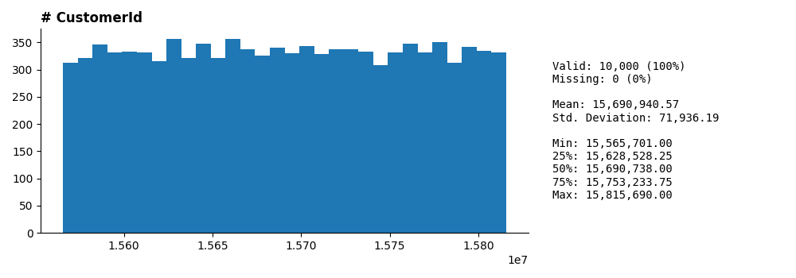 | 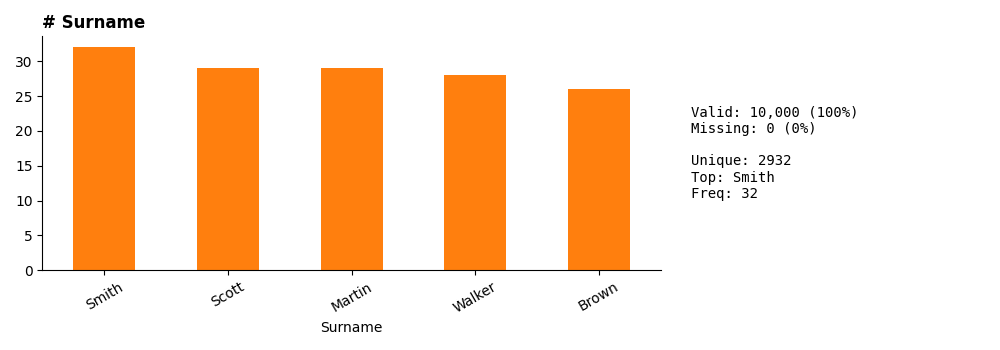 |
| 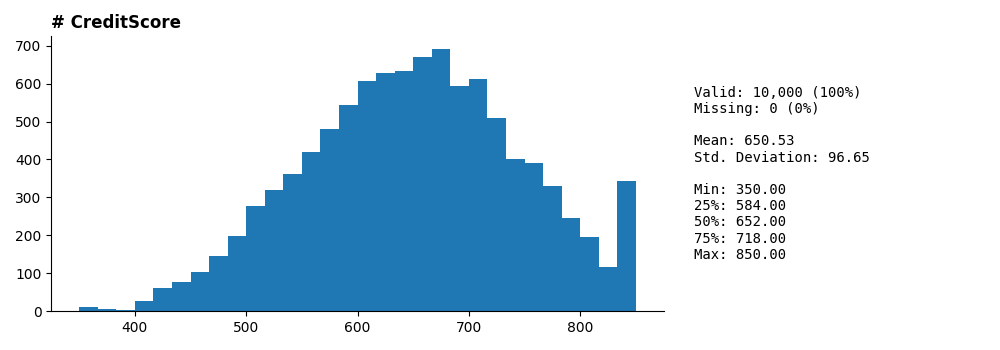 | 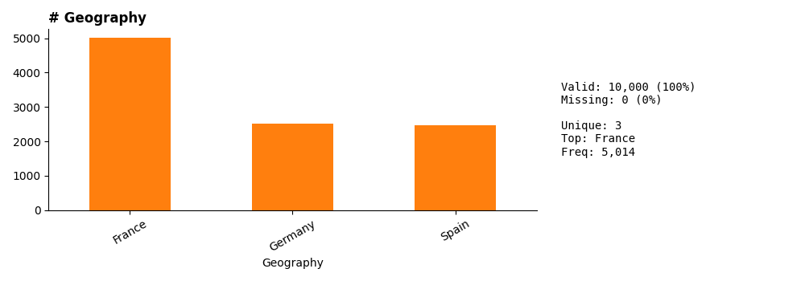 | 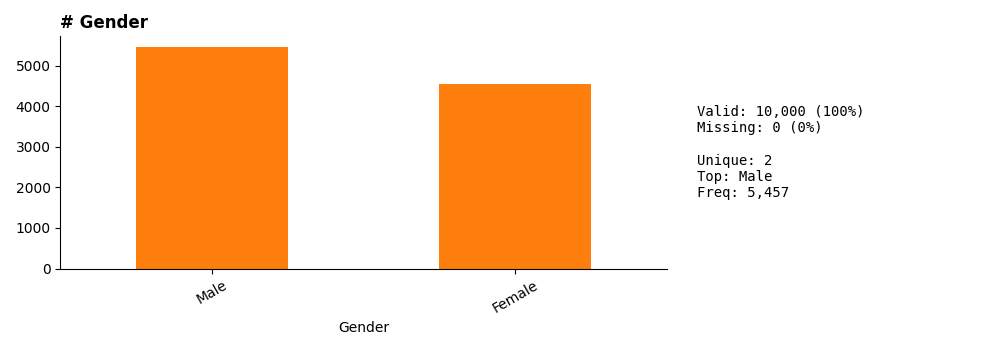 |
| 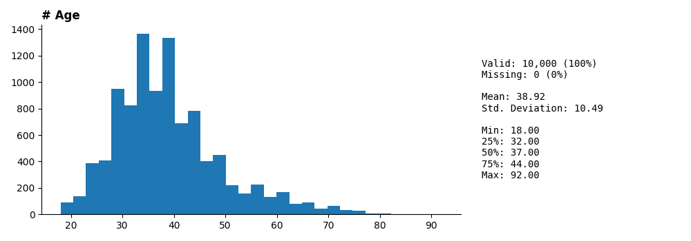 | 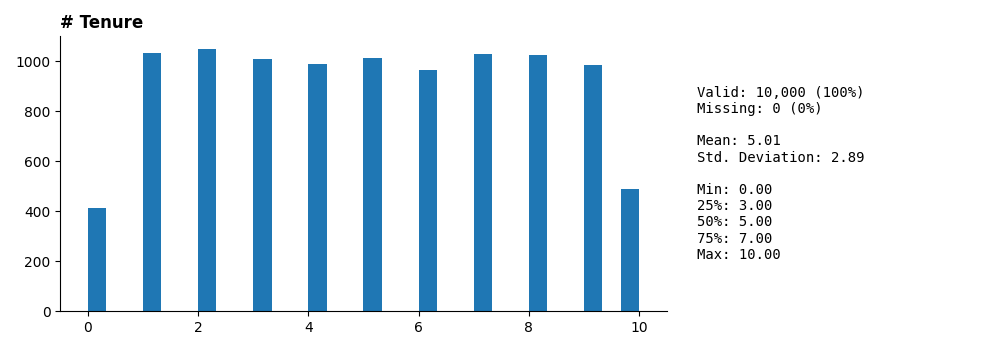 | 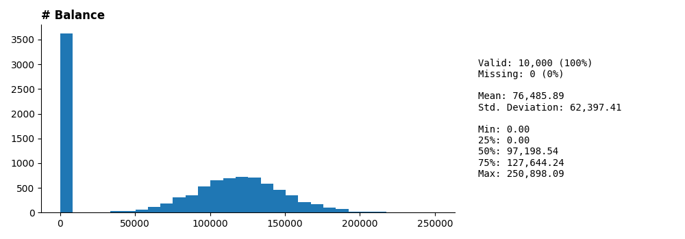 |
| 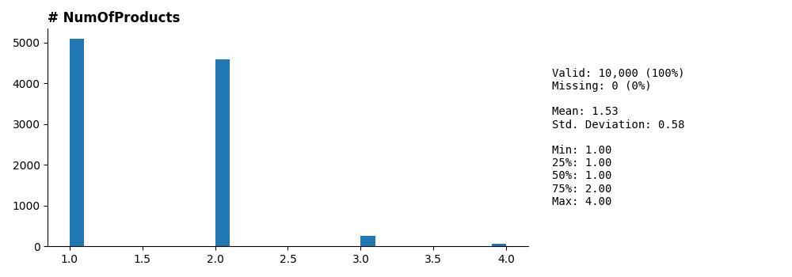 | 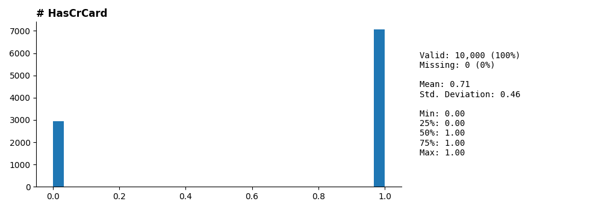 | 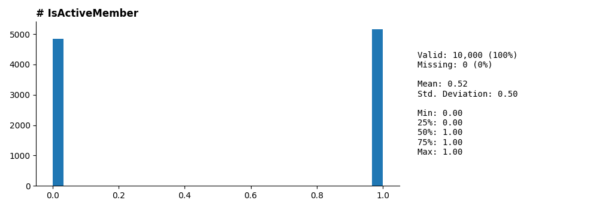 |
| 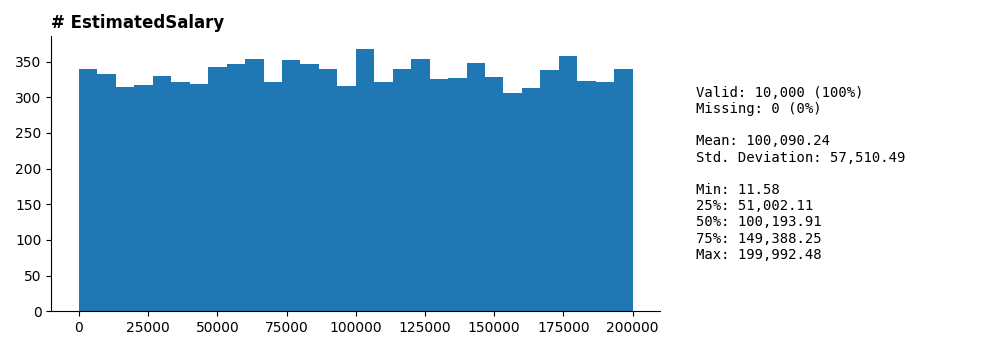 | 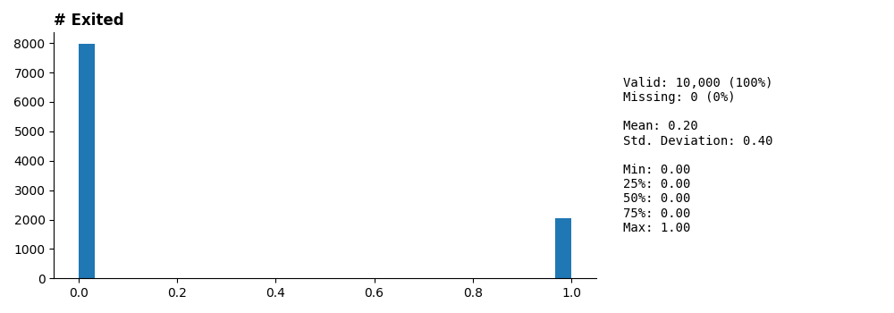 | |

## 🔍 Phân tích tương quan chính (với `Exited`)

| Biến | Hệ số tương quan (r) |
|---|---|
| Age | +0.29 |
| Balance | +0.12 |
| IsActiveMember | −0.16 |
| Các biến khác (CreditScore, Tenure, NumOfProducts, EstimatedSalary, HasCrCard) | ~0 đến −0.05 |

Ghi chú: `Balance` và `NumOfProducts` có tương quan âm đáng chú ý với nhau (r = −0.30).

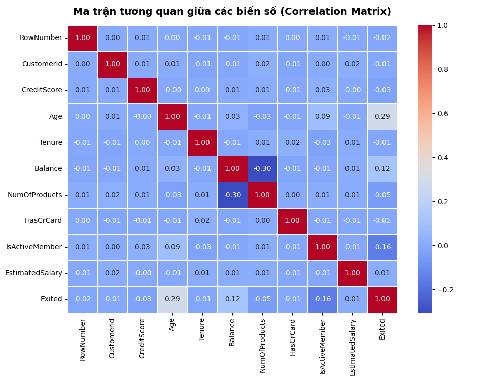

##  Tiền xử lý dữ liệu

1. Loại bỏ cột định danh: `RowNumber`, `CustomerId`, `Surname`.
2. Kiểm tra & xác nhận không có missing values / duplicates.
3. Chuyển đổi kiểu dữ liệu (category cho biến phân loại, int/float cho biến số).
4. **One-Hot Encoding** cho `Geography`, `Gender` (drop_first=True).
5. **Feature Engineering:**
   - `BalanceSalaryRatio` = Balance / (EstimatedSalary + ε)
   - `TenureByAge` = Tenure / (Age + ε)
6. **Chuẩn hóa (StandardScaler)** cho các biến số liên tục (không áp dụng cho biến nhị phân/one-hot).
7. **Xử lý mất cân bằng lớp:** SMOTE (áp dụng trên tập train sau khi split).

Tập đặc trưng cuối cùng: **12 biến** (bao gồm 2 đặc trưng mới).

##  Mô hình sử dụng

| Mô hình | Vai trò | Tham số tối ưu (sau tuning) |
|---|---|---|
| Logistic Regression | Baseline, dễ diễn giải | C=0.01, solver='lbfgs' |
| Random Forest | Ensemble bagging | n_estimators=300, max_depth=10, min_samples_split=5 |
| XGBoost | Ensemble boosting | n_estimators=100, learning_rate=0.1, max_depth=4, subsample=1.0, colsample_bytree=0.6 |

**Phương pháp tối ưu:** Stratified 5-Fold Cross-validation kết hợp Random Search (thu hẹp vùng tham số) rồi Grid Search (tinh chỉnh).

##  Kết quả đánh giá (trên tập test 2.000 mẫu)

| Model | Accuracy | Precision | Recall | F1-score | ROC-AUC |
|---|---|---|---|---|---|
| Logistic Regression | 0.7190 | 0.3946 | 0.7125 | 0.5079 | 0.7775 |
| Random Forest | 0.8685 | 0.8303 | 0.4447 | 0.5792 | 0.8640 |
| **XGBoost** | **0.8670** | 0.7975 | 0.4644 | **0.5870** | **0.8700** |

### Confusion Matrix (số lượng)

| Model | TN | FP | FN | TP |
|---|---|---|---|---|
| Logistic Regression | 1148 | 445 | 117 | 290 |
| Random Forest | 1556 | 37 | 226 | 181 |
| XGBoost | 1545 | 48 | 218 | 189 |

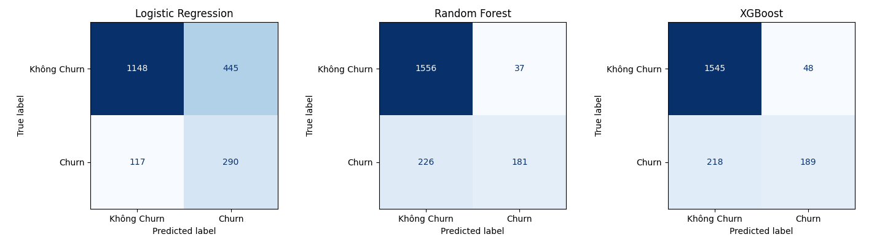

### Đường cong ROC

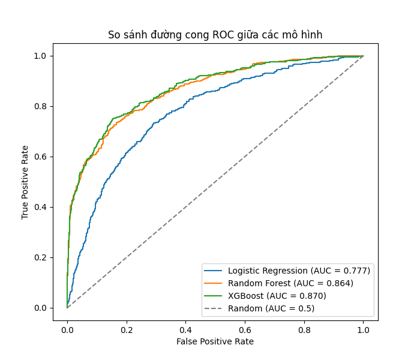

###  Mô hình được chọn: **XGBoost**

Lý do: ROC-AUC và F1-score cao nhất, cân bằng tốt giữa khả năng phát hiện khách hàng rời bỏ (Recall) và kiểm soát báo động giả (Precision), đồng thời ổn định qua cross-validation.

##  Giải thích mô hình (SHAP)

Các yếu tố ảnh hưởng mạnh nhất đến churn (theo thứ tự):

1. **NumOfProducts** — số lượng sản phẩm sử dụng
2. **Age** — tuổi càng cao, nguy cơ churn càng tăng
3. **IsActiveMember** — không hoạt động tích cực → tăng nguy cơ rời bỏ
4. **Geography_Germany** — khách hàng tại Đức có xu hướng churn cao hơn
5. Gender_Male, BalanceSalaryRatio, Balance, TenureByAge, EstimatedSalary, CreditScore...

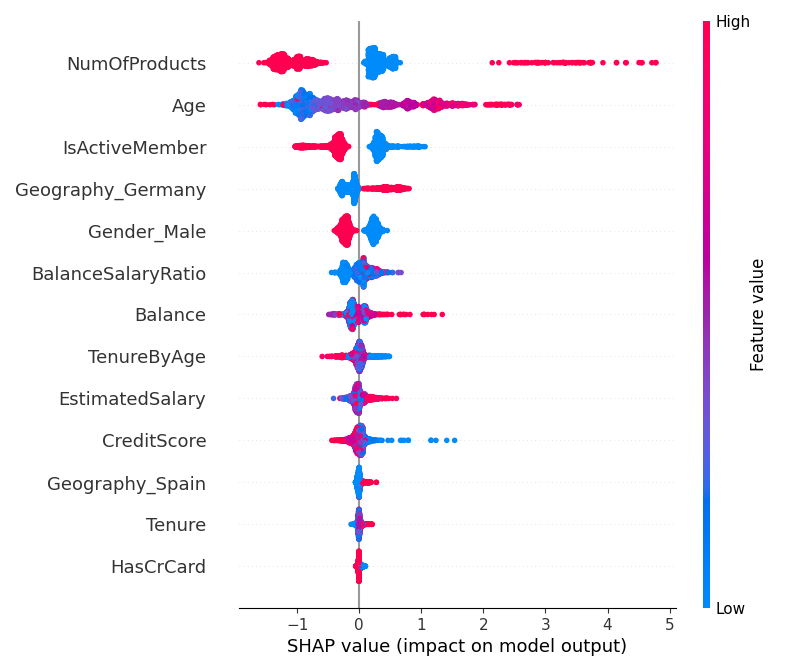

##  Phân tích Customer Retention (phân nhóm rủi ro)

| Nhóm rủi ro | Số lượng KH | Đặc điểm chính | Đề xuất giữ chân |
|---|---|---|---|
| **Nguy cơ cao** (≥0.7) | 138 | Tuổi cao, không hoạt động, số dư lớn, số sản phẩm chưa tối ưu | Ưu đãi cá nhân hóa, chăm sóc trực tiếp |
| **Nguy cơ trung bình** (0.4–0.7) | 179 | Tương tác giảm dần, sử dụng đơn lẻ sản phẩm | Chương trình khuyến mãi định kỳ |
| **Nguy cơ thấp** (<0.4) | 1683 | Trẻ tuổi, hoạt động thường xuyên, đa dạng sản phẩm | Duy trì trải nghiệm hiện tại |

##  Công nghệ sử dụng

- **Ngôn ngữ:** Python 3.10+
- **Xử lý dữ liệu:** Pandas, NumPy
- **Trực quan hóa:** Matplotlib, Seaborn
- **Machine Learning:** Scikit-learn, XGBoost
- **Giải thích mô hình:** SHAP
- **Giao diện demo:** Streamlit
- **Môi trường:** Google Colab

##  Quy trình tổng thể

```
Dữ liệu khách hàng → Tiền xử lý → EDA → Feature Engineering
→ Xây dựng mô hình → Tối ưu (CV + Random/Grid Search)
→ Đánh giá mô hình → Giải thích (SHAP) → Phân tích Customer Retention
```

##  Hạn chế

- Dữ liệu quy mô vừa phải, thuộc lĩnh vực ngân hàng, chưa phản ánh đa dạng ngành khác.
- SMOTE tạo mẫu tổng hợp có thể không phản ánh đúng phân phối thực tế.
- Mô hình ensemble (RF, XGBoost) có tính "hộp đen" cao hơn Logistic Regression.
- Chưa có dữ liệu hành vi theo chuỗi thời gian (time-series).

##  Hướng phát triển

- Tối ưu hyperparameter bằng Bayesian Optimization (Optuna/Hyperopt).
- Thử các biến thể SMOTE nâng cao (Borderline-SMOTE, ADASYN, SMOTE-Tomek).
- Bổ sung đặc trưng hành vi theo thời gian.
- Thử nghiệm LightGBM, CatBoost, Deep Learning cho dữ liệu dạng bảng.
- Xây dựng pipeline tự động hóa huấn luyện lại mô hình (MLflow).
- Phát triển Dashboard theo dõi churn, tích hợp CRM, hệ thống cảnh báo sớm.

---
